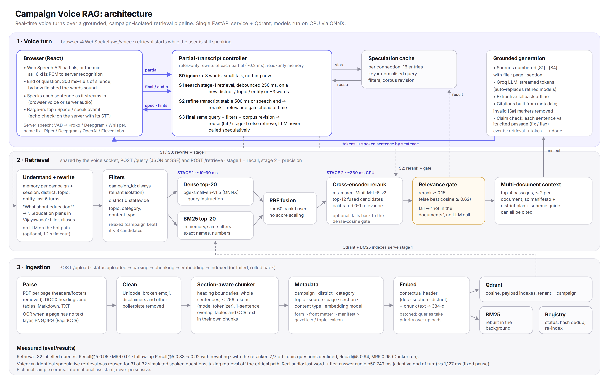

# Design note: real-time RAG for a voice campaign assistant

**Goal.** Citizens ask a campaign assistant questions by voice ("I'm from Vijayawada, any new
hospitals?") and get a short spoken answer that is grounded in the campaign's own documents,
cites them, and says "not in the documents" instead of guessing. It has to feel like a
conversation: answers must start quickly, follow-ups must work, and the user must be able to
interrupt. All data here is fictional; the assistant is informational, never persuasive.

## 1. Retrieval: decisions and evidence

Every choice below was measured on 32 labelled queries (direct, district, multi-document,
follow-up, disfluent voice-style, exact names, and 7 that must be refused). Labels are evidence
phrases, not chunk ids, so different chunkers are scored fairly
([retrieval_eval.md](../eval/results/retrieval_eval.md)).

| Decision | Why | Measured |
|---|---|---|
| Section-aware chunks, ≤256 tokens (model tokenizer), one-sentence overlap, contextual header for embedding only | Campaign documents are organised by district and topic; a chunk should not straddle "Healthcare" and "Education" | Recall within the first 300 retrieved words 0.85 vs 0.71 (fixed 180-word chunks) |
| bge-small-en-v1.5 on ONNX (no PyTorch), with its query instruction | 512-token window fits header + chunk; CPU inference in single-digit ms | instruction on vs off: Recall@5 0.78 vs 0.75 |
| Hybrid dense + BM25, fused with RRF (k = 60) | Scheme names, numbers and place names are exact-match problems; RRF needs no score calibration | Recall@5 0.81 vs 0.78 dense, 0.74 BM25 |
| Conversation memory + rule-based query rewriting (no LLM on the hot path) | "What about education?" means nothing on its own; a rule rewrite costs ~0.2 ms and runs on every partial transcript | Recall@5 0.81 → 0.95; follow-ups 0.33 → 0.92 |
| District filter = district ∪ statewide, relaxed if it leaves < 3 candidates; campaign filter always | A Vijayawada citizen also needs statewide schemes; tenant isolation must never be relaxed | — |
| Cross-encoder rerank of the top 12, used as the relevance gate (τ = 0.15) | Dense cosine separates on-topic from off-topic poorly (margin ~0 on this set); the cross-encoder's probability is calibrated | 7/7 off-topic questions declined vs 6/7; Recall@5 0.94, MRR 0.95 (Docker run) |
| Top-4 context with at most 2 passages per document | Questions often need the manifesto + a district plan + a scheme guide | multi-document coverage reported per query |
| Citations built from metadata; the model only writes [S#] markers | The model cannot invent a file, page or section; invalid markers are stripped | 100% of answers cite (answer eval) |
| Every sentence checked against the passage it cites (figures, districts, names, content words; cross-encoder for paraphrase) | A valid marker says nothing about whether the passage supports the sentence; a wrong figure or district is the damaging hallucination here | 99.6% of 253 corrupted claims caught, 0% of 443 correct ones flagged ([verifier_eval.md](../eval/results/verifier_eval.md), synthetic) |
| The gate refuses before the LLM is called | A refusal costs nothing and cannot be hallucinated | — |

## 2. The real-time voice path

Latency a user perceives is **end of speech → first spoken word**. It is spent in four places:
detecting that the user finished (endpointing), retrieval, the LLM's time to first token, and
the speech engine starting. The design attacks each one.

1. **Streaming recognition, in the browser or on the server.**
   - *Browser:* the Web Speech API streams partial transcripts. Chrome's single-shot mode cuts
     questions at the first pause, so recognition runs continuously and the client decides the end.
   - *Server* (`STT_PROVIDER`): the browser streams 16 kHz PCM from an AudioWorklet over the same
     WebSocket; the server runs VAD (Silero) and a streaming recogniser: local sherpa-onnx
     (Kroko zipformer, ~0.05× real time on CPU, audio never leaves the server), Deepgram, or
     Whisper on any OpenAI-compatible endpoint. Misheard names are corrected against the district
     gazetteer and the campaign's own proper names ("Vid, awada" → Vijayawada).
2. **End of turn from the words, not a fixed pause** (`app/voice/endpointing.py`). A fixed 900 ms
   timeout taxes every finished question to protect the slowest mid-sentence pause. The transcript
   tells the difference: "…for chilli farmers in" needs more, "…for chilli farmers in Guntur"
   doesn't. Each partial gets a verdict, sent to the browser as a hint for its timer or used
   directly by server recognition:
   - complete (300 ms): a question or request that lands on its subject (a place or topic after a
     preposition, a scheme name, a pronoun the conversation resolves), small talk, an introduction;
   - likely (550 ms): a full clause without such a landing;
   - unsure (900 ms, the old pause): no cue;
   - incomplete (1,600 ms): ends on "for", "the", "and", "how many", a filler ("um").
   Server recognition flushes the recogniser at every pause (re-decoding the utterance with silence
   appended, a few % of its length), so the verdict sees the last word rather than a transcript
   still trailing the audio. Push-to-talk (Space) ends the turn on release.
3. **Speculative retrieval on partial transcripts** (the controller in `app/voice/controller.py`):
   - **S0:** partials under 3 words, small talk and self-introductions are ignored.
   - **S1:** when a partial gains a district, topic or named entity, or three more words, the
     cheap stage-1 search (dense ‖ BM25 → RRF) runs, debounced by 250 ms.
   - **S2:** once the transcript has been stable for 500 ms, the recognizer reports the end of
     speech, or the end-of-turn verdict is "complete", the expensive stage (rerank + gate) runs on
     the cached candidates. This happens *during the endpointing silence*, which the user is
     waiting through anyway.
   - **S3:** the final transcript is rewritten with the committed memory. If the normalised query,
     filters and corpus revision match a speculation, it is reused and the LLM starts at once.
   - **Correctness rules.** Speculation only reads memory, the key includes the corpus revision,
     and the LLM is never called speculatively, because it costs money and its answer depends on
     the exact final wording.
4. **Speak while generating.** Tokens are cut into sentences as they stream; each sentence is
   spoken as soon as it is complete (decimals and "Dr." don't split). Citations are stripped from
   speech but shown on screen. With the server voice (`TTS_PROVIDER`: local Piper or Kokoro via
   sherpa-onnx, Deepgram Aura, OpenAI-compatible, ElevenLabs) the first piece may end at a comma or
   colon, so synthesis starts on a short clause; audio is streamed back as ~250 ms binary frames and
   played gaplessly with Web Audio. With `CITATION_VERIFICATION=strict` each sentence is checked
   against its sources before it is spoken.
5. **Barge-in.** Tapping the mic, pressing Space, or (in conversation mode) simply speaking stops
   speech output immediately, cancels the server-side generation, and starts listening. With server
   recognition the server does this itself: it keeps the microphone stream during the answer, knows
   from its playback schedule what the user is hearing, and treats speech as an interruption once
   it becomes two or more words that do not follow what is being said (word *pairs*, so a question
   that reuses some of the answer's words still counts). The interruption becomes the next
   question, first words included.
6. **Fallbacks.** No Web Speech API (Firefox) → server recognition, or recording with
   voice-activity detection and `POST /transcribe`. WebSocket down → the same answer over SSE. No
   LLM key → a labelled extractive answer that quotes the passages. A speech provider that fails to
   load is reported in `/health` and the browser's own speech is used.

**Measured** on real audio ([speech_eval.md](../eval/results/speech_eval.md): every eval question
spoken by the local voice and streamed in real time into `/ws/voice`, recognised by Kroko; no LLM
key here, so model time-to-first-token is not included): last word → first answer audio p50 **749 ms** with adaptive end of turn vs **1,127 ms** with the fixed 900 ms pause (turn ends 560 vs 920 ms after the last word; first spoken clause synthesised in ~180 ms); barge-in caught 5/5, ~0.93 s from the user's first word; word error rate 18.6%, districts recognised 23% (offline decode: 0% → 31% with name correction).

**End-of-turn rules alone** ([endpointing_eval.md](../eval/results/endpointing_eval.md), transcripts
of the 32 questions word by word): a finished question waits 484 ms on average instead of 900 ms;
55% of mid-question points now wait 1.6 s instead of 900 ms (protected); the cost is that a pause
longer than 300–550 ms right after a phrase that already sounds complete ends the turn (26% of
mid-question points at a 700 ms pause). The setting can be turned off in the app.

**Speculation** ([latency_benchmark.md](../eval/results/latency_benchmark.md); speech simulated at
250 ms per word, final transcript 900 ms after the last word):

- **Reuse:** the speculation was reused in full for 31 of 32 questions.
- **Effect:** retrieval left the critical path entirely (p50 0 ms vs 13.8 ms without speculation in
  that run, which had no reranker).
- **With the reranker:** stage 2 adds a measured ~230 ms p50 on CPU (Docker run). S2 hides exactly
  this cost inside the endpointing silence; run `run_latency_benchmark.py --rerank` to measure the saving.
- **Biggest cost:** endpointing dominated end of speech → first word at a fixed 900 ms; the
  adaptive end of turn above is the fix, and push-to-talk skips it.

## 3. Reliability and safety

- **Tenant isolation.** `campaign_id` is enforced in the retriever: no code path can search without it.
- **Grounding.** The prompt allows only the numbered sources, treats source text as data (prompt
  injection), keeps answers neutral, and makes them 2–4 speakable sentences.
- **Verified citations.** `app/generation/verify.py` checks each answer sentence against the
  passages it cites. Hard checks: every figure must appear there ("15 lakh", "2,400"), every
  district named must be one the passage covers (a statewide passage covers any district only on
  its own, never lending "Guntur" to a Vijayawada passage's facts), and capitalised names must
  appear. Soft check: half of the sentence's content words must appear (question words and framing
  like "the manifesto proposes" don't count), or the cross-encoder must judge the passage relevant.
  A failing sentence is re-attributed to a passage that supports it if there is one, else flagged
  (underlined in the UI, listed in the Sources panel) or, with `strict`, removed and not spoken.
  It runs in under a millisecond per sentence without the cross-encoder.
- **Hardening.**
  - Write endpoints are protected by `API_KEY`, and the WebSocket checks `Origin`.
  - Errors reach clients only as a reference id.
  - Retired Groq models are replaced automatically; reasoning models get token headroom so answers aren't cut off.
- **Ingestion is resilient.**
  - Documents move through `uploaded → … → indexed`; on failure, partial chunks are rolled back.
  - OCR runs on scanned pages, and broken emoji are cleaned.
  - Duplicates are detected by content hash, and queries take priority over uploads on the shared ONNX session.

## 4. Evaluation summary

| Area | Result | Source |
|---|---|---|
| Retrieval | Recall@5 0.95, MRR 0.91, context recall 0.89 (default pipeline, no reranker) | `retrieval_eval.md` |
| Reranker | 7/7 off-topic declined; every off-topic score ≤ 0.0008, answered questions ≈ 0.9 and above | `rerank_docker_run.md` |
| Answers | decision accuracy 97%, citation accuracy 92%, number faithfulness 100% (extractive fallback, so faithful by construction; run with Groq and `--judge` for the real LLM, which now also reports the claim check and its agreement with the judge) | `answer_eval.md` |
| Claim check | 99.6% of corrupted claims caught, 0% of correct ones flagged (696 synthetic claims) | `verifier_eval.md` |
| End of turn | finished questions wait 484 ms on average instead of 900 ms | `endpointing_eval.md` |
| Voice, real audio | last word → first audio p50 749 ms (adaptive) vs 1,127 ms (fixed 900 ms); barge-in 5/5, ~0.93 s; WER 18.6% (local Kroko) | `speech_eval.md` |
| Voice, simulated | 31/32 speculative reuse | `latency_benchmark.md` |
| Tests | 185 backend tests; Playwright: 16 checks of the browser-speech flow, 10 of server speech with real audio | `backend/tests`, `frontend/e2e` |

## 5. Limitations and next steps

- **Local recognition accuracy.** Kroko is a small general-English model: ~18% word error rate on
  clean synthetic speech, and place names are often misheard (the corrector recovers about a third of
  the districts). Indian-English speakers and noise will do worse; Deepgram (with key terms) or
  Whisper are the accurate options, the local model the private one.
- **End-of-turn rules are rules.** They are measured on 32 questions; an audio-aware turn model
  (prosody) and real usage logs would tune them better.
- **No LLM measured here.** No API key was available while building, so answer faithfulness of a
  real LLM, its agreement with the claim check, and time-to-first-token need
  `GROQ_API_KEY=… python eval/run_answer_eval.py --rerank --judge` and the latency scripts.
- **Speculative generation.** Starting the LLM at S2 and discarding it if the final transcript
  differs would hide time to first token too, at the cost of wasted tokens.
- **Telugu and code-mixed speech.** This needs multilingual embeddings (e.g. bge-m3) and
  transliteration-aware place names.
- **Scale.**
  - BM25 is in memory per process; Qdrant sparse vectors would make it shared.
  - The evaluation set (32 queries) is small. It should grow from real logs, with an LLM judge
    calibrated against human labels.
